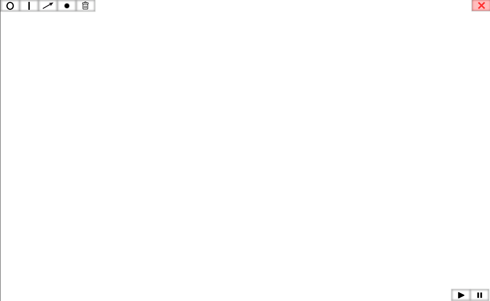
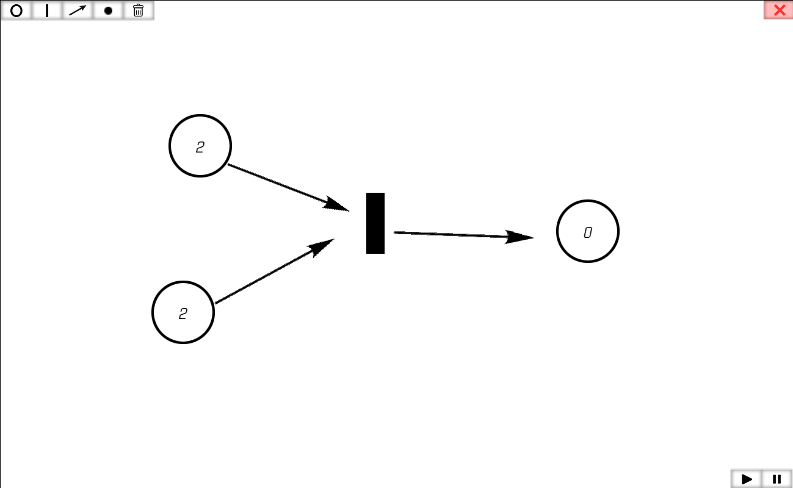

# PetriNets Application

## Overview
The Petri Net Application is a powerful tool designed for modeling, simulating, and analyzing Petri nets. Petri nets are a mathematical representation of distributed systems and are widely used in various fields such as computer science, engineering, and process management.

## Installation
Clone the repository:
    ```console
    git clone https://github.com/feed619/PetriNets
    ```
## Start application 
    ```
    open Petri.exe
    ```

## Start game :

Open ```checkers.exe```. 

### An application window will open where you can create Petri nets.
<p align="center"></p>

### Add places and transitions using the appropriate tools in the toolbar. Connect places and transitions using arcs.
<p align="center"></p>

## Feedback:

I'm always glad to hear your feedback and suggestions for improving my project. Please leave your feedback.

- [Email](mailto:feed619pro@gmail.com)
